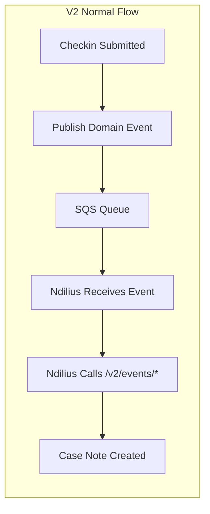
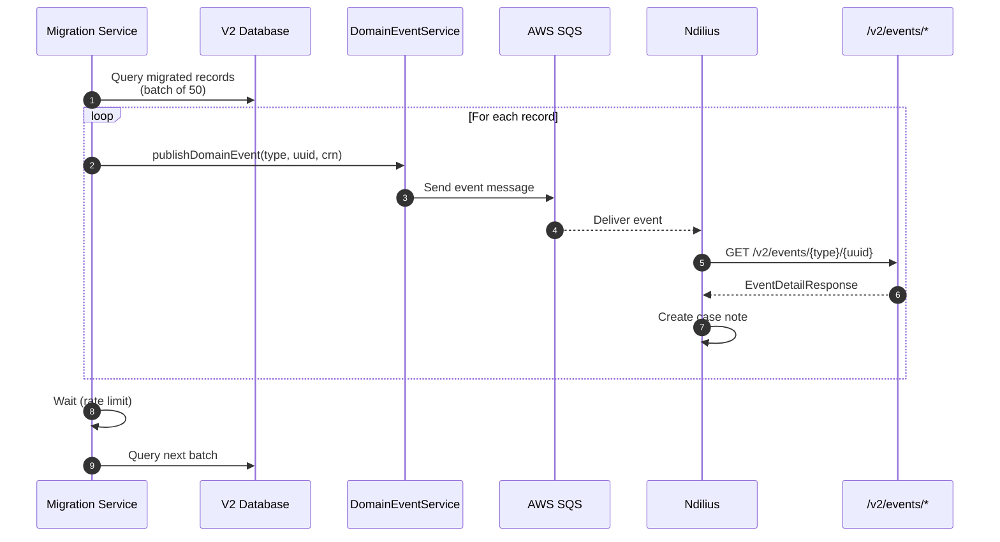

# V1 to V2 Data Migration Guide

Migrating existing V1 offenders and checkins to V2 tables with domain event publishing.

**Related:** [V2 Architecture Overview](v2/README.md) | [Domain Events](v2/DOMAIN_EVENTS.md)

---

## Table of Contents

1. [Overview](#1-overview)
2. [Why API-Based Migration](#2-why-api-based-migration)
3. [Migration Phases](#3-migration-phases)
4. [Phase 1: Data Migration (SQL)](#4-phase-1-data-migration-sql)
5. [Phase 2: Domain Event Replay (API)](#5-phase-2-domain-event-replay-api)
6. [Schema Mapping](#6-schema-mapping)
7. [Rollback Strategy](#7-rollback-strategy)
8. [Runbook](#8-runbook)

---

## 1. Overview

### Current State
- **V1 UI** (probation-checkin-ui, mpop-ui) already uses **V2 API endpoints**
- New offenders are being registered in V2 tables
- V1 tables contain historical data that needs to be migrated

### Migration Goal
Migrate V1 offenders and checkins to V2 tables while:
1. Preserving all historical data
2. Publishing domain events so Ndilius receives notes
3. Maintaining S3 media file compatibility (via UUID preservation)
4. Not disrupting current V2 operations

### What Gets Migrated

| Entity | V1 Table | V2 Table | Notes |
|--------|----------|----------|-------|
| Offenders | `offender` | `offender_v2` | PII excluded, CRN required |
| Checkins | `offender_checkin` | `offender_checkin_v2` | All statuses |
| Event Logs | `offender_event_log` | `offender_event_log_v2` | Review comments |
| Notifications | `offender_checkin_notification` | `generic_notification_v2` | Optional |

---

## 2. Why API-Based Migration

### SQL-Only Migration is Insufficient

A pure SQL migration would:
- Copy data between tables
- Preserve UUIDs for S3 compatibility

But it would **NOT**:
- Publish domain events to SQS
- Trigger Ndilius to fetch event details
- Create case notes in Ndilius for historical checkins

### Domain Event Flow



For migrated data, we need to replay this flow so Ndilius has complete records.

### What Ndilius Needs

When a domain event is published, Ndilius:
1. Receives the event from SQS
2. Calls back to `/v2/events/{type}/{uuid}` to get formatted notes
3. Creates a case note with the details

**Event types that create case notes:**
- `V2_SETUP_COMPLETED` - Registration details
- `V2_CHECKIN_SUBMITTED` - Checkin details + survey responses
- `V2_CHECKIN_REVIEWED` - Review outcome + practitioner notes
- `V2_CHECKIN_EXPIRED` - Missed checkin record

---

## 3. Migration Phases

### Phase 1: Data Migration (SQL)
- Run SQL script to copy offenders and checkins
- Preserves UUIDs for S3 compatibility
- Excludes PII from offenders
- Creates ID mapping for foreign key resolution

### Phase 2: Domain Event Replay (API)
- Migration service reads migrated records
- Publishes domain events for each record
- Ndilius receives events and creates case notes
- Configurable batch size and rate limiting

### Phase 3: Validation
- Verify record counts match
- Spot-check case notes in Ndilius
- Validate S3 media access still works

---

## 4. Phase 1: Data Migration (SQL)

### Pre-Migration Checklist

- [ ] Database backup completed
- [ ] V2 liquibase migrations applied
- [ ] Identify offenders without CRN (will be skipped)
- [ ] Resolve duplicate CRNs if any
- [ ] Coordinate with Ndilius team for Phase 2 timing

### SQL Migration Script

**Location:** `scripts/v1_to_v2_data_migration.sql`

```sql
-- ============================================================================
-- Phase 1: Data-Only Migration (No Domain Events)
-- ============================================================================

-- Step 1: Validate prerequisites
SELECT 'V1 Offenders with CRN' as check, COUNT(*) as count
FROM offender WHERE status = 'VERIFIED' AND crn IS NOT NULL AND TRIM(crn) != '';

SELECT 'Duplicate CRNs (must be 0)' as check, COUNT(*) as count FROM (
    SELECT crn FROM offender
    WHERE status = 'VERIFIED' AND crn IS NOT NULL
    GROUP BY crn HAVING COUNT(*) > 1
) dups;

-- Step 2: Create temporary mapping table
CREATE TEMP TABLE migration_offender_map (
    v1_id BIGINT PRIMARY KEY,
    v2_id BIGINT,
    crn VARCHAR(7),
    uuid UUID
);

-- Step 3: Migrate offenders
BEGIN;

INSERT INTO offender_v2 (uuid, crn, practitioner_id, status, first_checkin,
                         checkin_interval, created_at, created_by, updated_at, contact_preference)
SELECT
    o.uuid,
    UPPER(TRIM(o.crn)),
    o.practitioner,
    o.status,
    COALESCE(o.first_checkin, CURRENT_DATE),
    o.checkin_interval,
    o.created_at,
    o.practitioner,
    o.updated_at,
    CASE WHEN o.phone_number IS NOT NULL THEN 'PHONE'::contact_type_v2
         ELSE 'EMAIL'::contact_type_v2 END
FROM offender o
WHERE o.status = 'VERIFIED'
  AND o.crn IS NOT NULL AND TRIM(o.crn) != ''
  AND NOT EXISTS (SELECT 1 FROM offender_v2 v WHERE v.crn = UPPER(TRIM(o.crn)));

-- Record mapping
INSERT INTO migration_offender_map (v1_id, v2_id, crn, uuid)
SELECT o.id, v2.id, v2.crn, v2.uuid
FROM offender o
JOIN offender_v2 v2 ON o.uuid = v2.uuid;

COMMIT;

-- Step 4: Migrate checkins
BEGIN;

INSERT INTO offender_checkin_v2 (uuid, offender_id, status, due_date, survey_response,
                                  created_at, created_by, submitted_at, review_started_at,
                                  reviewed_at, reviewed_by, checkin_started_at,
                                  auto_id_check, manual_id_check)
SELECT
    c.uuid,
    m.v2_id,
    c.status,
    c.due_date,
    c.survey_response,
    c.created_at,
    c.created_by,
    c.submitted_at,
    c.review_started_at,
    c.reviewed_at,
    c.reviewed_by,
    c.checkin_started_at,
    c.id_check_auto,
    c.id_check_manual
FROM offender_checkin c
JOIN migration_offender_map m ON c.offender_id = m.v1_id
WHERE NOT EXISTS (SELECT 1 FROM offender_checkin_v2 v WHERE v.uuid = c.uuid);

COMMIT;

-- Step 5: Migrate event logs
BEGIN;

INSERT INTO offender_event_log_v2 (uuid, log_entry_type, comment, practitioner,
                                    created_at, checkin, offender_id)
SELECT
    e.uuid,
    e.log_entry_type::log_entry_type_v2,
    e.comment,
    e.practitioner,
    e.created_at,
    cv2.id,
    m.v2_id
FROM offender_event_log e
JOIN migration_offender_map m ON e.offender_id = m.v1_id
LEFT JOIN offender_checkin c ON e.checkin = c.id
LEFT JOIN offender_checkin_v2 cv2 ON c.uuid = cv2.uuid
WHERE NOT EXISTS (SELECT 1 FROM offender_event_log_v2 v WHERE v.uuid = e.uuid);

COMMIT;

-- Step 6: Validate
SELECT 'Migrated Offenders' as entity, COUNT(*) FROM migration_offender_map
UNION ALL
SELECT 'V2 Checkins', COUNT(*) FROM offender_checkin_v2
UNION ALL
SELECT 'V2 Event Logs', COUNT(*) FROM offender_event_log_v2;
```

---

## 5. Phase 2: Domain Event Replay (API)

### Why This Phase is Needed

After SQL migration, the data exists in V2 tables but:
- Ndilius has no case notes for migrated checkins
- No audit trail in `event_audit_log_v2`
- Domain events were never published

### Event Replay Strategy



### Events to Publish Per Record

| Record Type | Events to Publish |
|-------------|-------------------|
| Offender (VERIFIED) | `V2_SETUP_COMPLETED` |
| Checkin (SUBMITTED) | `V2_CHECKIN_SUBMITTED` |
| Checkin (REVIEWED) | `V2_CHECKIN_SUBMITTED` + `V2_CHECKIN_REVIEWED` |
| Checkin (EXPIRED, reviewed) | `V2_CHECKIN_EXPIRED` + (review event if reviewed) |
| Checkin (EXPIRED, not reviewed) | `V2_CHECKIN_EXPIRED` |
| Checkin (CREATED) | No event (awaiting submission) |

### Migration Service Implementation

Create a Kotlin service/job for event replay:

```kotlin
// MigrationEventReplayService.kt
@Service
class MigrationEventReplayService(
    private val checkinRepository: OffenderCheckinV2Repository,
    private val offenderRepository: OffenderV2Repository,
    private val domainEventService: DomainEventService,
    private val clock: Clock,
) {
    private val logger = LoggerFactory.getLogger(javaClass)

    /**
     * Replay domain events for migrated offenders
     * Call this after SQL migration is complete
     */
    fun replayOffenderEvents(batchSize: Int = 50, delayMs: Long = 100) {
        logger.info("Starting offender event replay")

        var offset = 0
        var totalProcessed = 0

        do {
            val batch = offenderRepository.findMigratedWithoutAudit(
                PageRequest.of(0, batchSize)
            )

            batch.forEach { offender ->
                try {
                    domainEventService.publishDomainEvent(
                        eventType = DomainEventType.V2_SETUP_COMPLETED,
                        uuid = offender.uuid,
                        crn = offender.crn,
                        description = "[MIGRATION] Registration completed for ${offender.crn}"
                    )
                    totalProcessed++
                    Thread.sleep(delayMs) // Rate limiting
                } catch (e: Exception) {
                    logger.error("Failed to publish event for offender {}", offender.uuid, e)
                }
            }

            offset += batch.size
            logger.info("Processed {} offenders", totalProcessed)

        } while (batch.isNotEmpty())

        logger.info("Offender event replay complete: {} events published", totalProcessed)
    }

    /**
     * Replay domain events for migrated checkins
     */
    fun replayCheckinEvents(batchSize: Int = 50, delayMs: Long = 100) {
        logger.info("Starting checkin event replay")

        var totalProcessed = 0

        // Process SUBMITTED checkins
        checkinRepository.findMigratedByStatus(CheckinV2Status.SUBMITTED).use { stream ->
            stream.forEach { checkin ->
                publishCheckinSubmittedEvent(checkin)
                totalProcessed++
                Thread.sleep(delayMs)
            }
        }

        // Process REVIEWED checkins (need both SUBMITTED and REVIEWED events)
        checkinRepository.findMigratedByStatus(CheckinV2Status.REVIEWED).use { stream ->
            stream.forEach { checkin ->
                publishCheckinSubmittedEvent(checkin)
                Thread.sleep(delayMs)
                publishCheckinReviewedEvent(checkin)
                totalProcessed += 2
                Thread.sleep(delayMs)
            }
        }

        // Process EXPIRED checkins
        checkinRepository.findMigratedByStatus(CheckinV2Status.EXPIRED).use { stream ->
            stream.forEach { checkin ->
                if (checkin.submittedAt != null) {
                    publishCheckinSubmittedEvent(checkin)
                    Thread.sleep(delayMs)
                }
                publishCheckinExpiredEvent(checkin)
                if (checkin.reviewedAt != null) {
                    Thread.sleep(delayMs)
                    publishCheckinReviewedEvent(checkin)
                }
                totalProcessed++
                Thread.sleep(delayMs)
            }
        }

        logger.info("Checkin event replay complete: {} events published", totalProcessed)
    }

    private fun publishCheckinSubmittedEvent(checkin: OffenderCheckinV2) {
        domainEventService.publishDomainEvent(
            eventType = DomainEventType.V2_CHECKIN_SUBMITTED,
            uuid = checkin.uuid,
            crn = checkin.offender.crn,
            description = "[MIGRATION] Check-in submitted for ${checkin.offender.crn}"
        )
    }

    private fun publishCheckinReviewedEvent(checkin: OffenderCheckinV2) {
        domainEventService.publishDomainEvent(
            eventType = DomainEventType.V2_CHECKIN_REVIEWED,
            uuid = checkin.uuid,
            crn = checkin.offender.crn,
            description = "[MIGRATION] Check-in reviewed for ${checkin.offender.crn}"
        )
    }

    private fun publishCheckinExpiredEvent(checkin: OffenderCheckinV2) {
        domainEventService.publishDomainEvent(
            eventType = DomainEventType.V2_CHECKIN_EXPIRED,
            uuid = checkin.uuid,
            crn = checkin.offender.crn,
            description = "[MIGRATION] Check-in expired for ${checkin.offender.crn}"
        )
    }
}
```

### Repository Queries for Migration

```kotlin
// Add to OffenderV2Repository
@Query("""
    SELECT o FROM OffenderV2 o
    WHERE NOT EXISTS (
        SELECT 1 FROM EventAuditV2 a
        WHERE a.crn = o.crn AND a.eventType = 'V2_SETUP_COMPLETED'
    )
""")
fun findMigratedWithoutAudit(pageable: Pageable): List<OffenderV2>

// Add to OffenderCheckinV2Repository
@Query("""
    SELECT c FROM OffenderCheckinV2 c
    WHERE c.status = :status
    AND NOT EXISTS (
        SELECT 1 FROM EventAuditV2 a
        WHERE a.checkinUuid = c.uuid
    )
""")
fun findMigratedByStatus(status: CheckinV2Status): Stream<OffenderCheckinV2>
```

### Admin Endpoint for Migration

```kotlin
@RestController
@RequestMapping("/admin/migration")
@PreAuthorize("hasRole('ROLE_ADMIN')")
class MigrationAdminResource(
    private val migrationService: MigrationEventReplayService,
) {
    @PostMapping("/replay-offender-events")
    fun replayOffenderEvents(
        @RequestParam(defaultValue = "50") batchSize: Int,
        @RequestParam(defaultValue = "100") delayMs: Long,
    ): ResponseEntity<Map<String, String>> {
        // Run async to avoid timeout
        Thread { migrationService.replayOffenderEvents(batchSize, delayMs) }.start()
        return ResponseEntity.ok(mapOf("status" to "started"))
    }

    @PostMapping("/replay-checkin-events")
    fun replayCheckinEvents(
        @RequestParam(defaultValue = "50") batchSize: Int,
        @RequestParam(defaultValue = "100") delayMs: Long,
    ): ResponseEntity<Map<String, String>> {
        Thread { migrationService.replayCheckinEvents(batchSize, delayMs) }.start()
        return ResponseEntity.ok(mapOf("status" to "started"))
    }
}
```

---

## 6. Schema Mapping

### Offender Table Mapping

| V1 Column (`offender`) | V2 Column (`offender_v2`) | Transformation |
|------------------------|---------------------------|----------------|
| `id` | `id` | New ID generated |
| `uuid` | `uuid` | **Preserve** (S3 paths) |
| `crn` | `crn` | UPPER + TRIM, required |
| `first_name` | - | **Not migrated** (PII) |
| `last_name` | - | **Not migrated** (PII) |
| `date_of_birth` | - | **Not migrated** (PII) |
| `email` | - | **Not migrated** (PII) |
| `phone_number` | - | **Not migrated** (PII) |
| `practitioner` | `practitioner_id` | Direct copy |
| `status` | `status` | Direct copy |
| `first_checkin` | `first_checkin` | Default CURRENT_DATE if null |
| `checkin_interval` | `checkin_interval` | Direct copy |
| `created_at` | `created_at` | Direct copy |
| `updated_at` | `updated_at` | Direct copy |
| - | `created_by` | = practitioner |
| phone_number/email | `contact_preference` | Derive: PHONE if phone exists, else EMAIL |

### Checkin Table Mapping

| V1 Column (`offender_checkin`) | V2 Column (`offender_checkin_v2`) | Transformation |
|--------------------------------|-----------------------------------|----------------|
| `id` | `id` | New ID generated |
| `uuid` | `uuid` | **Preserve** (S3 paths) |
| `offender_id` | `offender_id` | Map via migration table |
| `status` | `status` | Direct copy |
| `due_date` | `due_date` | Direct copy |
| `survey_response` | `survey_response` | Direct copy (JSONB) |
| `created_at` | `created_at` | Direct copy |
| `created_by` | `created_by` | Direct copy |
| `submitted_at` | `submitted_at` | Direct copy |
| `review_started_at` | `review_started_at` | Direct copy |
| - | `review_started_by` | NULL (not in V1) |
| `reviewed_at` | `reviewed_at` | Direct copy |
| `reviewed_by` | `reviewed_by` | Direct copy |
| `checkin_started_at` | `checkin_started_at` | Direct copy |
| `id_check_auto` | `auto_id_check` | Direct copy |
| `id_check_manual` | `manual_id_check` | Direct copy |
| - | `risk_feedback` | NULL (not in V1) |

---

## 7. Rollback Strategy

### Phase 1 Rollback (Data)

```sql
-- Only run if Phase 2 has NOT started
BEGIN;

DELETE FROM offender_event_log_v2
WHERE uuid IN (SELECT uuid FROM offender_event_log);

DELETE FROM offender_checkin_v2
WHERE uuid IN (SELECT uuid FROM offender_checkin);

DELETE FROM offender_v2
WHERE uuid IN (SELECT uuid FROM offender WHERE status = 'VERIFIED');

COMMIT;
```

### Phase 2 Rollback (Events)

Domain events cannot be "un-published" from SQS. However:
- Case notes in Ndilius can be manually deleted if needed
- Audit log entries can be deleted from `event_audit_log_v2`

```sql
-- Remove audit entries for migrated records (identified by [MIGRATION] prefix)
DELETE FROM event_audit_log_v2
WHERE notes LIKE '[MIGRATION]%';
```

---

## 8. Runbook

### Pre-Migration (Day Before)

- [ ] Notify Ndilius team of migration window
- [ ] Take database backup
- [ ] Verify V2 tables exist (liquibase applied)
- [ ] Run pre-validation queries
- [ ] Resolve any CRN issues

### Phase 1 Execution

```bash
# 1. Connect to production database
psql -h $DB_HOST -U $DB_USER -d $DB_NAME

# 2. Run data migration script
\i scripts/v1_to_v2_data_migration.sql

# 3. Validate results
SELECT 'Offenders migrated', COUNT(*) FROM offender_v2;
SELECT 'Checkins migrated', COUNT(*) FROM offender_checkin_v2;
```

### Phase 2 Execution

```bash
# 1. Enable migration endpoints (feature flag or deploy config change)

# 2. Start offender event replay
curl -X POST "https://api.example.com/admin/migration/replay-offender-events?batchSize=50&delayMs=100" \
  -H "Authorization: Bearer $ADMIN_TOKEN"

# 3. Monitor logs for completion
kubectl logs -f deployment/esupervision-api | grep "event replay"

# 4. Start checkin event replay
curl -X POST "https://api.example.com/admin/migration/replay-checkin-events?batchSize=50&delayMs=100" \
  -H "Authorization: Bearer $ADMIN_TOKEN"

# 5. Monitor until complete
```

### Post-Migration

- [ ] Run validation queries
- [ ] Spot-check case notes in Ndilius (5-10 random CRNs)
- [ ] Verify S3 media access works for migrated checkins
- [ ] Disable migration endpoints
- [ ] Update documentation

### Troubleshooting

| Issue | Resolution |
|-------|------------|
| Event not received by Ndilius | Check SQS DLQ, verify event format |
| Case note missing | Re-publish individual event via admin API |
| Wrong data in case note | Check EventDetailV2Service formatting |
| Rate limit exceeded | Increase delay, reduce batch size |
| Migration taking too long | Increase parallelism (carefully) |

---

## Appendix: Estimated Migration Times

Based on 100ms delay between events:

| Records | Estimated Time |
|---------|----------------|
| 1,000 offenders | ~2 minutes |
| 10,000 offenders | ~17 minutes |
| 1,000 checkins (mixed status) | ~3-5 minutes |
| 10,000 checkins | ~30-50 minutes |

Actual times will vary based on:
- Network latency to SQS
- Ndilius processing capacity
- Database query performance
