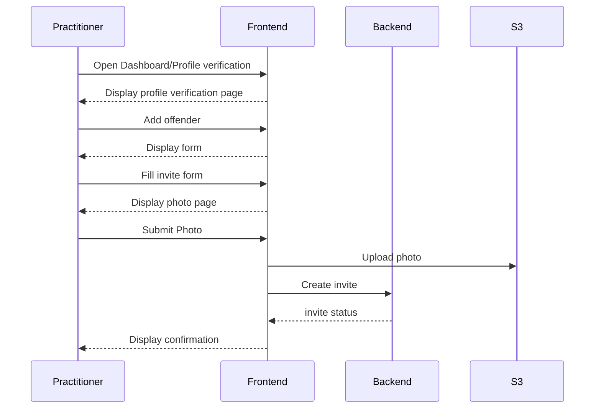
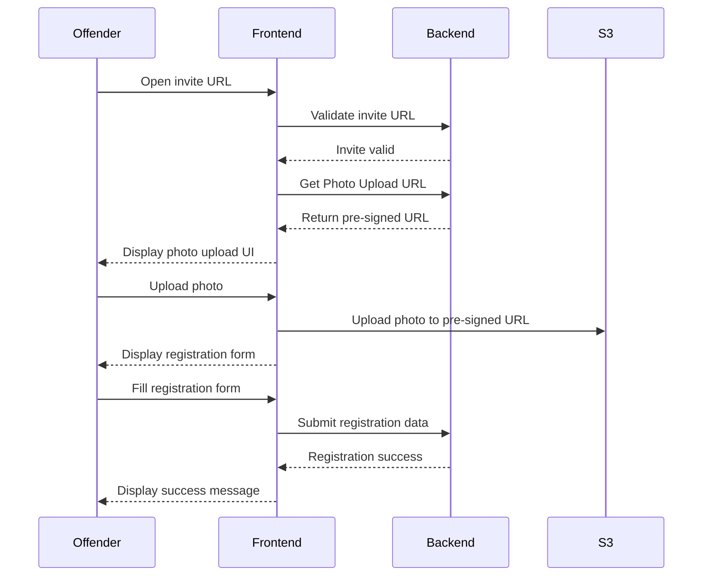

# Frontend/Backend Interactions

## Practitioner account setup

TODO

## Practitioner adds an Offender to the system

We assume the dev team manually (for now) created relevant records 
for practitioner.

## Offender does a remote checkin

At the start of this scenario, we assume the invite containing the unique checkin link 
was sent and received by the offender.

