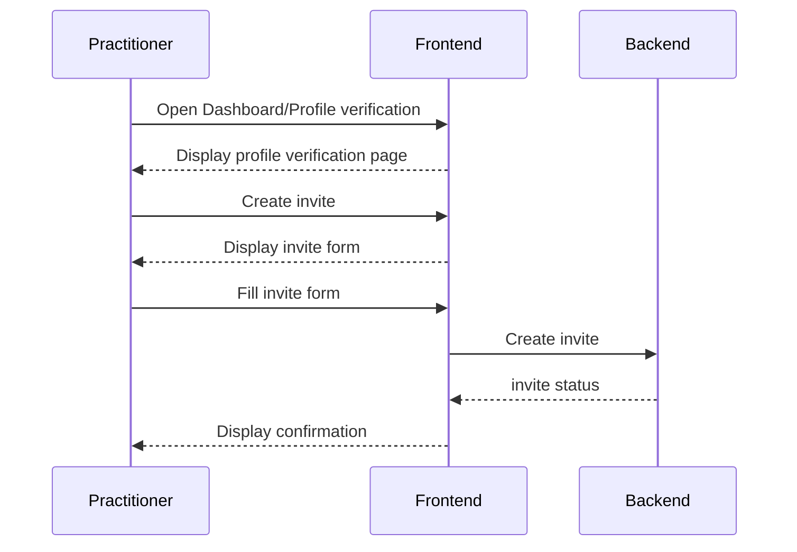
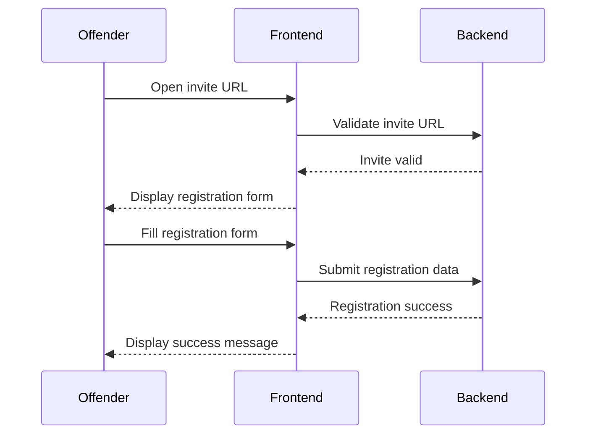

# Frontend/Backend Interactions

## Practitioner account setup

## Practitioner adds an Offender to the system

We assume the dev team manually (for now) created relevant records 
for practitioner.

## Offender responds to an invite

