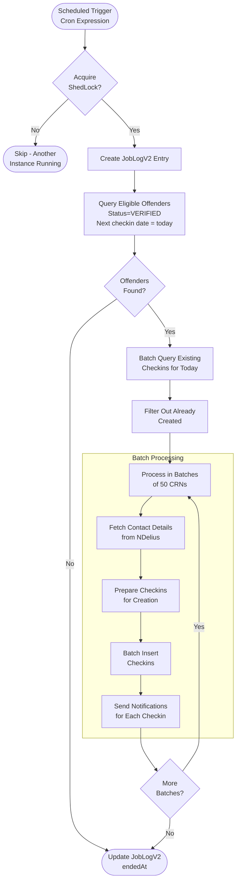
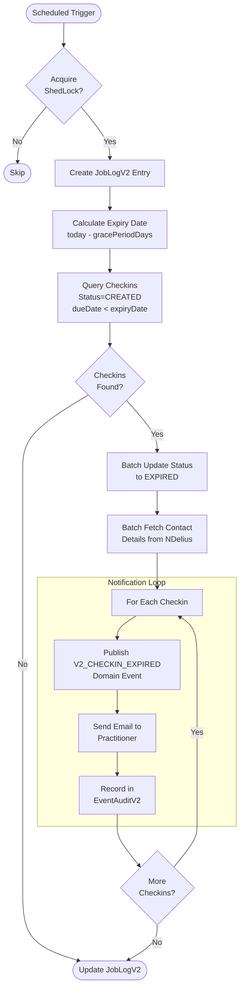

# V2 Background Jobs

Scheduled jobs that run automatically to manage checkin lifecycle.

---

## Job Overview

| Job | Purpose | Default Schedule |
|-----|---------|------------------|
| V2CheckinCreationJob | Create checkins for eligible offenders | Daily, configurable |
| V2CheckinExpiryJob | Mark overdue checkins as expired | Daily, configurable |

---

## 1. Checkin Creation Job

Creates checkins for verified offenders based on their configured schedule.

### Flow



### Configuration

```yaml
app:
  scheduling:
    v2-checkin-creation:
      cron: "0 0 6 * * *"  # 6 AM daily
```

### Eligibility Criteria

An offender is eligible for checkin creation if:
- `status = VERIFIED`
- `first_checkin IS NOT NULL`
- `checkin_interval IS NOT NULL`
- Next due date falls on today
- No existing checkin for today (any status except CANCELLED)

---

## 2. Checkin Expiry Job

Marks overdue checkins as expired and notifies practitioners.

### Flow



### Configuration

```yaml
app:
  scheduling:
    v2-checkin-expiry:
      cron: "0 0 7 * * *"  # 7 AM daily
      grace-period-days: 3  # Days after due date before expiry
```

### Expiry Logic

A checkin expires if:
- `status = CREATED` (not submitted)
- `due_date < (today - grace_period_days)`

Example with 3-day grace period:
- Checkin due: January 10
- Checkin window: January 10-12 (3 days to submit)
- Expiry date: January 13 (if still CREATED)

---

## ShedLock

Both jobs use ShedLock to prevent duplicate execution across instances.

```kotlin
@SchedulerLock(
    name = "V2 Checkin Creation Job",
    lockAtLeastFor = "PT5S",    // Hold lock for at least 5 seconds
    lockAtMostFor = "PT30M",    // Release lock after 30 minutes max
)
```

### Lock Table

Uses existing `shedlock` table shared with V1 jobs.

---

## Job Logging

Each job run creates a record in `job_log_v2`:

```sql
CREATE TABLE job_log_v2 (
    id BIGINT PRIMARY KEY,
    job_type VARCHAR(255) NOT NULL,  -- 'V2_CHECKIN_CREATION' or 'V2_CHECKIN_EXPIRY'
    created_at TIMESTAMP NOT NULL,   -- Job start time
    ended_at TIMESTAMP               -- Job end time (null if still running)
);
```

### Monitoring Queries

```sql
-- Recent job runs
SELECT job_type, created_at, ended_at,
       EXTRACT(EPOCH FROM (ended_at - created_at)) as duration_seconds
FROM job_log_v2
ORDER BY created_at DESC
LIMIT 20;

-- Jobs that didn't complete (potential issues)
SELECT * FROM job_log_v2
WHERE ended_at IS NULL
AND created_at < NOW() - INTERVAL '1 hour';
```

---

## Batch Processing

### NDelius API Batch Size

Contact details are fetched in batches to avoid overloading NDelius:

```kotlin
companion object {
    const val MAX_BATCH_SIZE = 50
}

crns.chunked(NDeliusApiClient.MAX_BATCH_SIZE).forEach { batchCrns ->
    val contactDetailsMap = NDeliusApiClient.getContactDetailsForMultiple(batchCrns)
    // Process batch...
}
```

### Performance Considerations

| Factor | Recommendation |
|--------|----------------|
| Batch size | 50 CRNs per NDelius call |
| Query streaming | Use `Stream<T>` for large result sets |
| Transaction scope | Separate transactions per batch |
| Memory | Process batches sequentially, not all in memory |
