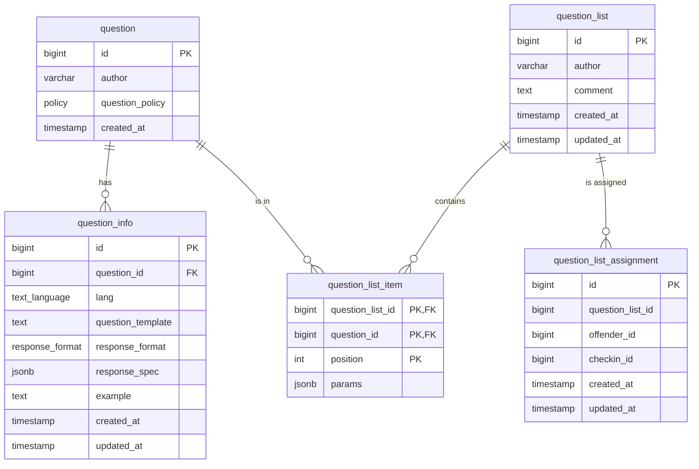

# Custom Questions

This document describes implementation details of the custom questions feature of online check ins.

## Feature description

Custom questions feature allows the practitioner to assign a set of questions that the offender will be presented with 
next time they check in. In its initial release the questions will come from a predefined list of questions. That list
will be available to all practitioners. 

Each custom question will allow the practitioner to customise it to some degree. 

The initial release of the feature will:
- allow to assign/remove a question list to the next upcoming check in only - there will be no automatic re-assignment of questions
- allow the practitioner to assign up to three questions per check in

## Data Model

The questions are modeled by the following tables:



There are constraints on the tables that enforce the following rules:
- each `question` with `author='SYSTEM'` must have exactly two `question_info` records (one per language)
- there can be only one upcoming `question_list_assignment` per `offender_id`, where "upcoming" means the check in
  has not been SUBMITTED or EXPIRED yet (it's possible it has been CREATED).
- a trigger will automatically set the `checkin_id` of a `qustion_list_assignment` when the check in's status changes

A few postgres functions allow to query and define the questions, question lists and question list assignments:

### `upsert_custom_question_list(question_list_id, author, questions)` 

Use this function to define a new custom list of questions. The function takes the questions as a JSONB array. 
Exact shape of each item the list depends on each question's `response_format`, but for `response_format=TEXT` 
it should match the following:

```typescript
type CustomQuestionItem = {
    id: Number
    params: {
        placeholders: Map<String,String>
    }
}

type AssignCustomQuestionsRequest = {
    questions: CustomQuestionItem[]
}
```

See `CustomQuestionItem` and `AssignCustomQuestionsRequest` DTOs. 

### `get_question_list(list_id, lang)`

Returns the full list of questions, including:
- any mandatory questions
- any customised question list items. Any template placeholders will be defined in the `params.placeholders` JSONB field. 

Data returned by this function can be used to interpolate the question templates.

### `get_question_templates(p_lang)`

Returns the list of available question templates.

## Predefined Questions

The initial release does not provide any content management system to manage the questions. 

The available CUSTOM and MANDATORY questions are defined in the migration script by using utility functions
- `define_system_question`
- `define_custom_question`

Additionally, a *default* list of questions is defined, and any of the query functions mentioned earlier can return the 
concatenated result of `[default..., custom...]`.

## API

### GET /v2/questions/templates

Use that to get a list of available question templates.

### PUT /v2/questions/assignment?crn=X000001

Assign a question list to the next upcoming check in.

### DELETE /v2/questions/assignment?crn=X000001

Remove any custom question list assignment from the upcoming check in.

### GET /v2/questions/question-list/{id}?language=en-GB

Returns question list items (template + params).

### GET /v2/questions/upcoming/{crn}/offender-questions

Returns the question list associated with upcoming checkin, in a form that should be viewed by the offender.

### GET /v2/questions/upcoming/{crn}/question-items

Returns the question list items (template + params) associated with upcoming checkin.