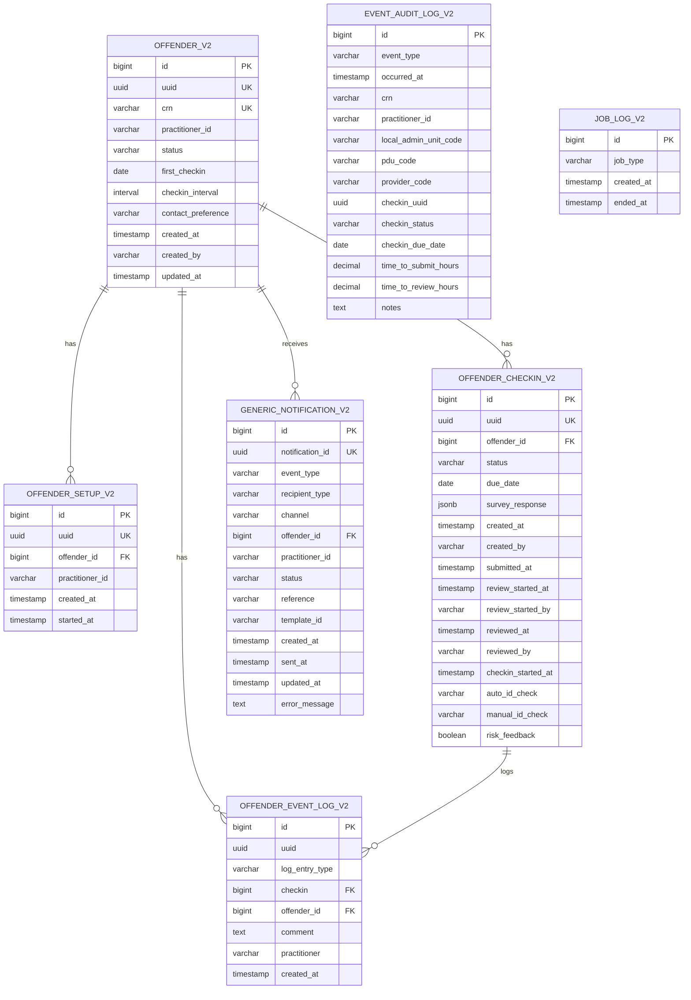
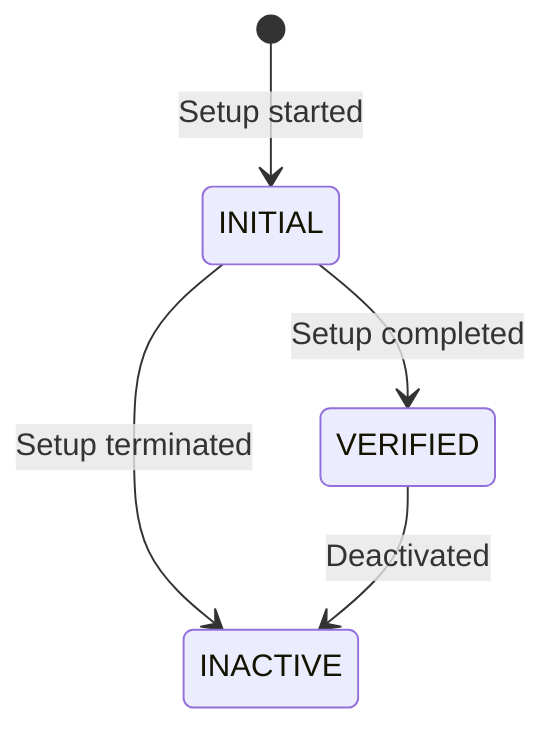
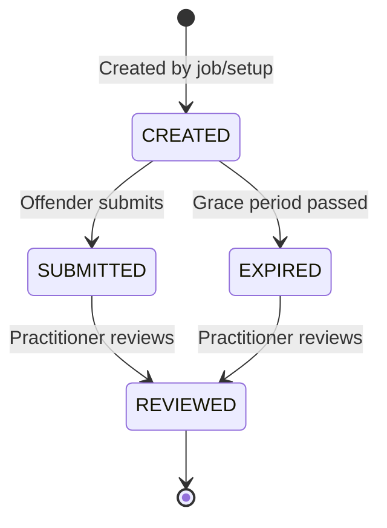

# V2 Data Model

Entity relationships and database schema for V2 tables.

---

## Entity Relationship Diagram



---

## Tables

### offender_v2

Stores offender records **without PII** - only CRN reference.

| Column | Type | Constraints | Description |
|--------|------|-------------|-------------|
| id | BIGINT | PK, AUTO | Internal ID |
| uuid | UUID | UNIQUE, NOT NULL | Public identifier |
| crn | VARCHAR(7) | UNIQUE, NOT NULL | Case Reference Number |
| practitioner_id | VARCHAR(255) | NOT NULL | Assigned practitioner |
| status | VARCHAR(50) | NOT NULL | INITIAL, VERIFIED, INACTIVE |
| first_checkin | DATE | NOT NULL | First scheduled checkin date |
| checkin_interval | INTERVAL | NOT NULL | Time between checkins |
| contact_preference | ENUM | | PHONE or EMAIL |
| created_at | TIMESTAMP | NOT NULL | Record creation time |
| created_by | VARCHAR(255) | NOT NULL | Creator (practitioner) |
| updated_at | TIMESTAMP | NOT NULL | Last update time |

### offender_checkin_v2

Stores checkin records with survey responses.

| Column | Type | Constraints | Description |
|--------|------|-------------|-------------|
| id | BIGINT | PK, AUTO | Internal ID |
| uuid | UUID | UNIQUE, NOT NULL | Public identifier |
| offender_id | BIGINT | FK, NOT NULL | Reference to offender |
| status | VARCHAR(50) | NOT NULL | CREATED, SUBMITTED, REVIEWED, EXPIRED, CANCELLED |
| due_date | DATE | NOT NULL | When checkin is due |
| survey_response | JSONB | | Survey answers |
| created_at | TIMESTAMP | NOT NULL | Creation time |
| created_by | VARCHAR(255) | NOT NULL | Creator (job or practitioner) |
| submitted_at | TIMESTAMP | | When offender submitted |
| checkin_started_at | TIMESTAMP | | When identity verification passed |
| review_started_at | TIMESTAMP | | When practitioner opened review |
| review_started_by | VARCHAR(255) | | Practitioner who started review |
| reviewed_at | TIMESTAMP | | When review completed |
| reviewed_by | VARCHAR(255) | | Practitioner who completed review |
| auto_id_check | VARCHAR(50) | | MATCH, NO_MATCH, NO_FACE_DETECTED, ERROR |
| manual_id_check | VARCHAR(50) | | CONFIRMED, REJECTED |
| risk_feedback | BOOLEAN | | Risk management feedback flag |

### generic_notification_v2

Tracks all sent notifications.

| Column | Type | Constraints | Description |
|--------|------|-------------|-------------|
| id | BIGINT | PK, AUTO | Internal ID |
| notification_id | UUID | UNIQUE, NOT NULL | GOV.UK Notify reference |
| event_type | VARCHAR(100) | NOT NULL | Triggering event type |
| recipient_type | VARCHAR(50) | NOT NULL | OFFENDER or PRACTITIONER |
| channel | VARCHAR(50) | NOT NULL | SMS or EMAIL |
| offender_id | BIGINT | FK | Reference to offender |
| practitioner_id | VARCHAR(255) | | Practitioner if recipient |
| status | VARCHAR(50) | | Delivery status |
| reference | VARCHAR(255) | NOT NULL | Internal reference |
| template_id | VARCHAR(255) | | GOV.UK Notify template ID |
| created_at | TIMESTAMP | NOT NULL | Creation time |
| sent_at | TIMESTAMP | | When sent to Notify |
| updated_at | TIMESTAMP | | Last status update |
| error_message | VARCHAR(1000) | | Error if failed |

### event_audit_log_v2

Analytics and reporting table for all events.

| Column | Type | Description |
|--------|------|-------------|
| event_type | VARCHAR(100) | Event type name |
| occurred_at | TIMESTAMP | When event occurred |
| crn | VARCHAR(7) | Offender CRN |
| practitioner_id | VARCHAR(255) | Practitioner ID |
| local_admin_unit_code | VARCHAR(50) | LAU code (from NDelius) |
| pdu_code | VARCHAR(50) | PDU code |
| provider_code | VARCHAR(50) | Provider code |
| checkin_uuid | UUID | Related checkin if applicable |
| checkin_status | VARCHAR(50) | Checkin status at time of event |
| time_to_submit_hours | DECIMAL | Hours from creation to submission |
| time_to_review_hours | DECIMAL | Hours from submission to review |
| notes | TEXT | Additional notes |

---

## Status Enums

### Offender Status



### Checkin Status



---

## Indexes

Key indexes for performance:

```sql
-- Offender lookups
CREATE INDEX idx_offender_v2_crn ON offender_v2(crn);
CREATE INDEX idx_offender_v2_status ON offender_v2(status);
CREATE INDEX idx_offender_v2_practitioner ON offender_v2(practitioner_id);

-- Checkin queries
CREATE INDEX idx_checkin_v2_offender ON offender_checkin_v2(offender_id);
CREATE INDEX idx_checkin_v2_status ON offender_checkin_v2(status);
CREATE INDEX idx_checkin_v2_due_date ON offender_checkin_v2(due_date);
CREATE INDEX idx_checkin_v2_status_due_date ON offender_checkin_v2(status, due_date);

-- Audit queries
CREATE INDEX idx_audit_v2_crn ON event_audit_log_v2(crn);
CREATE INDEX idx_audit_v2_occurred_at ON event_audit_log_v2(occurred_at);
CREATE INDEX idx_audit_v2_event_type ON event_audit_log_v2(event_type);
```
