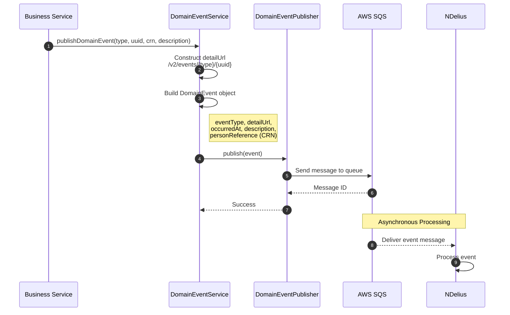
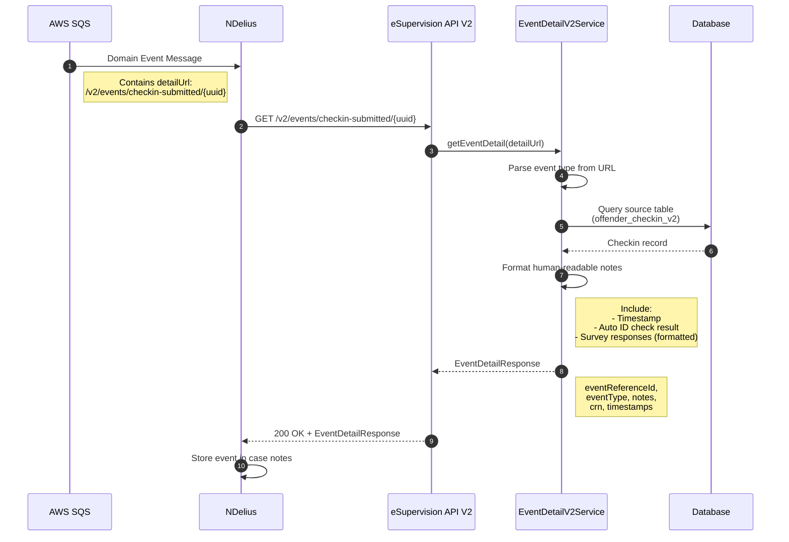
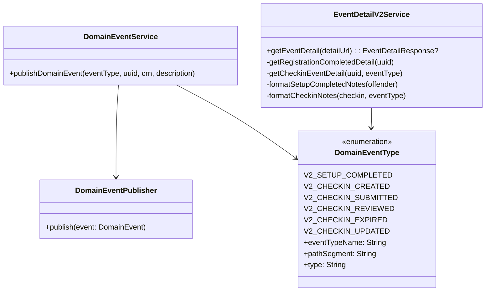

# V2 Domain Events

Domain events are published to AWS SQS for integration with NDelius and other downstream systems.

---

## Event Types

| Event Type | Path Segment | Description | Triggers Case Note |
|------------|--------------|-------------|-------------------|
| `V2_SETUP_COMPLETED` | `setup-completed` | Offender registration completed | Yes |
| `V2_CHECKIN_CREATED` | `checkin-created` | New checkin created | No |
| `V2_CHECKIN_SUBMITTED` | `checkin-submitted` | Offender submitted checkin | Yes |
| `V2_CHECKIN_REVIEWED` | `checkin-reviewed` | Practitioner reviewed checkin | Yes |
| `V2_CHECKIN_EXPIRED` | `checkin-expired` | Checkin marked as expired | Yes |
| `V2_CHECKIN_UPDATED` | `checkin-updated` | Checkin updated (annotated) | Yes |

---

## Event Publishing Flow



---

## Domain Event Structure

```kotlin
data class DomainEvent(
    val eventType: String,           // e.g., "probation-case.checkin.submitted"
    val detailUrl: String,           // Callback URL for event details
    val occurredAt: ZonedDateTime,   // When event occurred
    val description: String,         // Human-readable description
    val personReference: PersonReference,  // CRN identifier
)

data class PersonReference(
    val identifiers: List<PersonIdentifier>,
)

data class PersonIdentifier(
    val type: String,   // "CRN"
    val value: String,  // The actual CRN
)
```

---

## NDelius Callback Flow

When NDelius receives a domain event, it calls back to fetch formatted event details.



---

## Event Detail Response

```kotlin
data class EventDetailResponse(
    val eventReferenceId: String,  // e.g., "V2_CHECKIN_SUBMITTED-{uuid}"
    val eventType: String,         // e.g., "V2_CHECKIN_SUBMITTED"
    val notes: String,             // Human-readable formatted notes
    val crn: String,
    val offenderUuid: UUID,
    val checkinUuid: UUID?,
    val timestamp: Instant,
)
```

### Notes Formatting

The `notes` field contains human-readable text formatted for case notes:

**Setup Completed:**
```
Registration Completed
Offender UUID: {uuid}
CRN: {crn}
Practitioner: {practitionerId}
Status: VERIFIED
First check-in: {date}
Check-in interval: {interval}
```

**Checkin Submitted:**
```
Check in submitted: 15 January 2025 at 2:30pm
Automated ID check: Match

Survey response:
How they have been feeling: Good
Anything they need support with: Housing, Money
If they need us to contact them: Yes
What they want to talk about: Need help with rent
```

**Checkin Updated:**
```
Check in updated: 16 January 2025 at 10:00am
Updated by: U123456
Notes: Spoke to offender about housing issue. Referring to housing officer.
```

---

## Event Callback Endpoints

| Method | Endpoint | Description |
|--------|----------|-------------|
| `GET` | `/v2/events/setup-completed/{uuid}` | Setup completed event details |
| `GET` | `/v2/events/checkin-created/{uuid}` | Checkin created event details |
| `GET` | `/v2/events/checkin-submitted/{uuid}` | Checkin submitted event details |
| `GET` | `/v2/events/checkin-reviewed/{uuid}` | Checkin reviewed event details |
| `GET` | `/v2/events/checkin-expired/{uuid}` | Checkin expired event details |
| `GET` | `/v2/events/checkin-updated/{uuid}` | Checkin updated event details |

---

## Service Architecture



---

## Configuration

```yaml
app:
  apiBaseUrl: https://esupervision-api.example.com  # Base URL for detailUrl construction

# SQS configuration
hmpps:
  sqs:
    queues:
      domainevents:
        queueName: esupervision-domain-events
```
