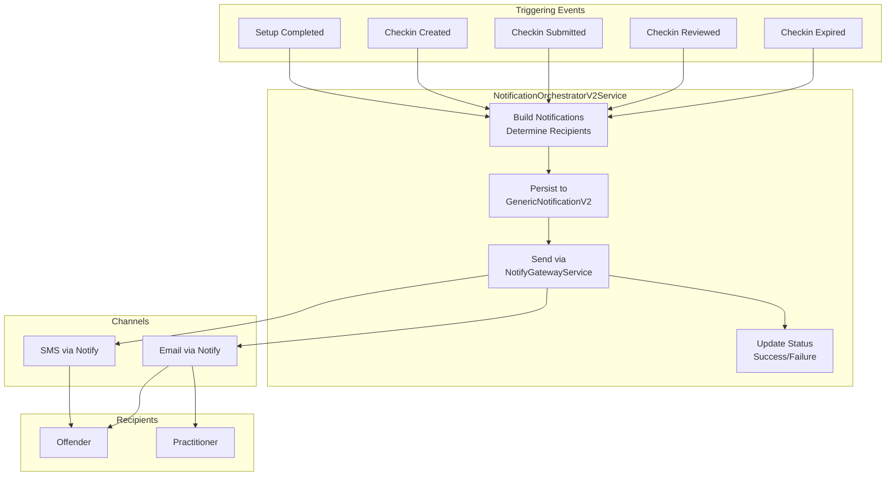
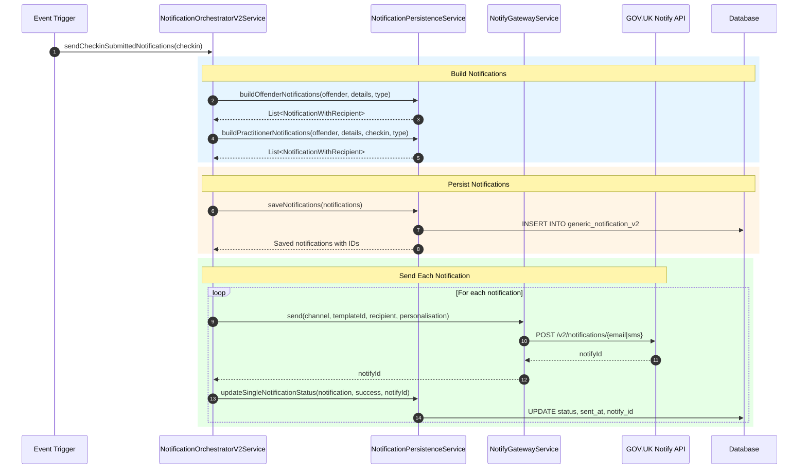
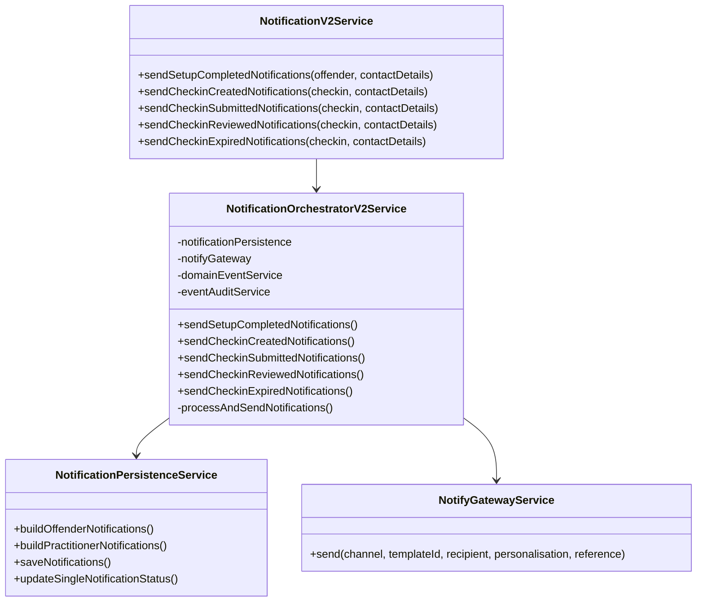

# V2 Notification System

The V2 notification system sends SMS and email notifications via GOV.UK Notify.

---

## Architecture



---

## Notification Matrix

| Event | Offender SMS | Offender Email | Practitioner Email |
|-------|-------------|----------------|-------------------|
| Setup Completed | Yes | Yes | No |
| Checkin Created | Yes | Yes | No |
| Checkin Submitted | Yes | Yes | Yes |
| Checkin Reviewed | No | No | No |
| Checkin Expired | No | No | Yes |

---

## Notification Flow



---

## Service Components



---

## GOV.UK Notify Templates

### Template Personalisation

Each notification type has specific personalisation fields:

**Setup Completed (Registration Confirmation):**
```
name: "John Smith"
date: "Monday 15 January 2025"
frequency: "week" | "two weeks" | "four weeks" | "eight weeks"
```

**Checkin Created (Checkin Invite):**
```
firstName: "John"
lastName: "Smith"
date: "Wednesday 17 January 2025"  // Final day to submit
url: "https://checkin.example.com/v2/checkin/{uuid}"
```

**Checkin Submitted (Confirmation):**
```
name: "John Smith"
practitionerName: "practitioner123"
number: "2"  // Number of flags
contactRequestFlag: "yes" // Yes or no values to determine the optional content in notify template
dashboardSubmissionUrl: "https://mpop.example.com/review/{uuid}"

```

**Checkin Expired (Practitioner Alert):**
```
practitionerName: "practitioner123"
name: "John Smith"
popDashboardUrl: "https://mpop.example.com/review/{uuid}"
```

---

## Database Schema

```sql
CREATE TABLE generic_notification_v2 (
    id BIGINT PRIMARY KEY,
    notification_id UUID UNIQUE NOT NULL,
    event_type VARCHAR(100) NOT NULL,
    recipient_type VARCHAR(50) NOT NULL,  -- 'OFFENDER' or 'PRACTITIONER'
    channel VARCHAR(50) NOT NULL,         -- 'SMS' or 'EMAIL'
    offender_id BIGINT REFERENCES offender_v2(id),
    practitioner_id VARCHAR(255),
    status VARCHAR(50),
    reference VARCHAR(255) NOT NULL,
    template_id VARCHAR(255),
    created_at TIMESTAMP NOT NULL,
    sent_at TIMESTAMP,
    updated_at TIMESTAMP,
    error_message VARCHAR(1000)
);
```

---

## Configuration

```yaml
notify:
  api-key: ${NOTIFY_API_KEY}
  templates:
    registration-confirmation:
      sms: "35274201-ecef-493b-b4e1-86e60d071142"
      email: "7e63c01c-05df-4b2c-a77c-57d2412793a1"
    checkin-invite:
      sms: "41f78d9f-95d1-45c4-bad2-ec53fcddc017"
      email: "3806414e-083e-410e-825a-76e2c72bbd8b"
    checkin-submitted-offender:
      sms: "80695bae-3917-436a-824b-c61ce04ca4a3"
      email: "8558a963-0d76-4ad5-82d3-3eb536c76563"
    checkin-submitted-practitioner:
      email: "${PRACTITIONER_CHECKIN_SUBMITTED_TEMPLATE_ID}"
    checkin-expired-practitioner:
      email: "${PRACTITIONER_CHECKIN_EXPIRED_TEMPLATE_ID}"
```

---

## Contact Preference

V2 supports offender contact preference stored in `offender_v2.contact_preference`:

| Preference | Behaviour |
|------------|-----------|
| `PHONE` | Primary: SMS, Fallback: Email |
| `EMAIL` | Primary: Email, Fallback: SMS |

If contact details are missing, notification is skipped with warning log.
