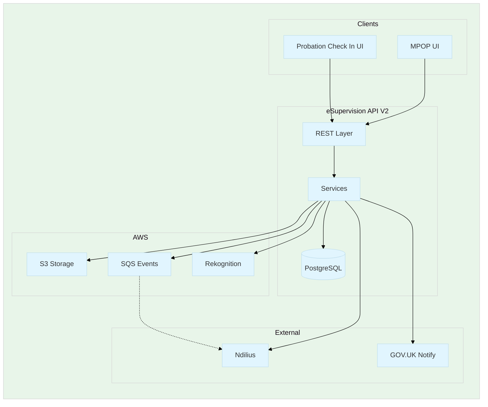
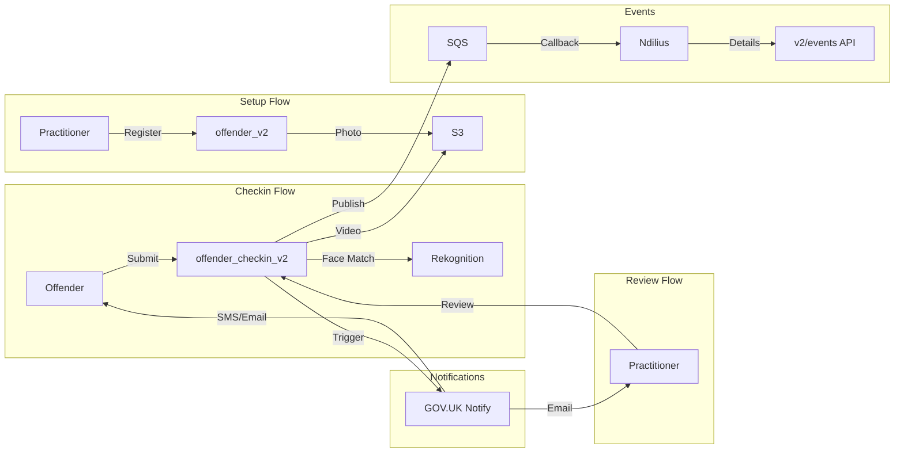

# V2 Architecture Overview

V2 is a complete architectural refactoring of the eSupervision API with improved data handling, performance, and integration.

---

## Key Improvements

| Aspect | V1 | V2 |
|--------|----|----|
| **PII Storage** | Stored in database | Fetched on-demand from Ndilius |
| **Code Isolation** | Shared with other modules | Separate `v2` package |
| **Database Tables** | Shared tables | Dedicated `_v2` suffix tables |
| **Performance** | N+1 queries | Batch operations, streaming |
| **Event Integration** | Limited | Full domain events to SQS |

---

## Documentation Index

| Document | Description |
|----------|-------------|
| [User Journeys](USER_JOURNEYS.md) | Setup, checkin, and review flows with diagrams |
| [Domain Events](DOMAIN_EVENTS.md) | Event types, publishing, Ndilius callbacks |
| [Notifications](NOTIFICATIONS.md) | SMS/Email notification system |
| [Background Jobs](BACKGROUND_JOBS.md) | Scheduled checkin creation and expiry |
| [Data Model](DATA_MODEL.md) | Entity relationships and schema |
| [Implementation Notes](IMPLEMENTATION_NOTES.md) | UI changes, test coverage, GDS compliance, TODOs |
| [Migration Guide](../V1_TO_V2_MIGRATION.md) | Migrating V1 data to V2 |

---

## System Architecture



---

## Package Structure

```
uk.gov.justice.digital.hmpps.esupervisionapi.v2/
├── V2Entities.kt              # JPA entities
├── V2Dtos.kt                  # Data Transfer Objects
├── V2Repositories.kt          # Spring Data repositories
├── CheckinV2Service.kt        # Core checkin logic
├── NotificationV2Service.kt   # Notification facade
├── DomainEventService.kt      # Domain event publishing
│
├── checkin/                   # Checkin endpoints and services
├── setup/                     # Offender setup flow
├── offender/                  # Offender management
├── audit/                     # Event audit logging
├── jobs/                      # Background jobs
├── domain/                    # Domain value objects
└── infrastructure/            # Technical concerns (S3, Rekognition, etc.)
```

---

## API Endpoints Summary

### Setup
| Method | Endpoint | Description |
|--------|----------|-------------|
| `POST` | `/v2/offender_setup` | Start offender setup |
| `POST` | `/v2/offender_setup/{uuid}/complete` | Complete setup |

### Checkins
| Method | Endpoint | Description |
|--------|----------|-------------|
| `GET` | `/v2/offender_checkins` | List checkins |
| `GET` | `/v2/offender_checkins/{uuid}` | Get checkin |
| `POST` | `/v2/offender_checkins/{uuid}/submit` | Submit checkin |
| `POST` | `/v2/offender_checkins/{uuid}/review` | Complete review |

### Events (Ndilius Callbacks)
| Method | Endpoint | Description |
|--------|----------|-------------|
| `GET` | `/v2/events/setup-completed/{uuid}` | Setup event details |
| `GET` | `/v2/events/checkin-submitted/{uuid}` | Submission details |
| `GET` | `/v2/events/checkin-reviewed/{uuid}` | Review details |

See [User Journeys](USER_JOURNEYS.md) for complete endpoint documentation.

---

## Data Flow Overview


