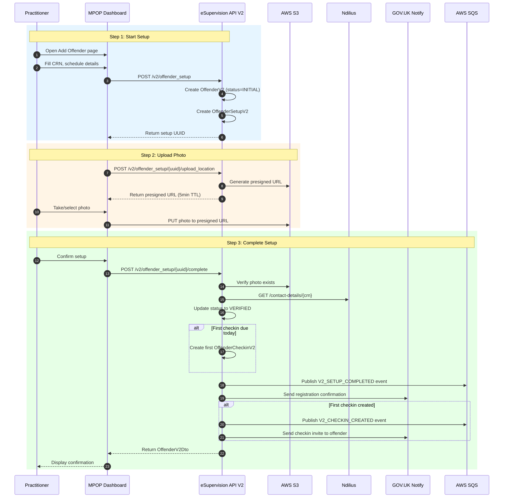
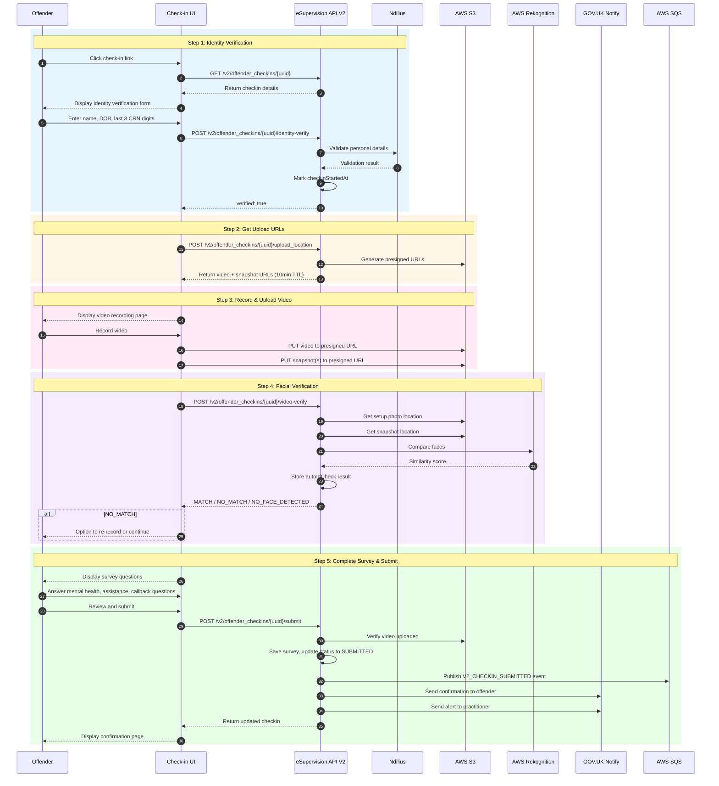
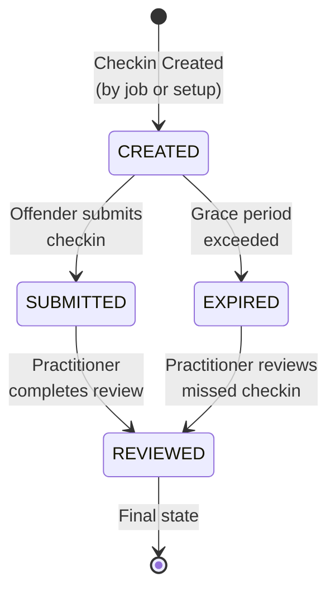
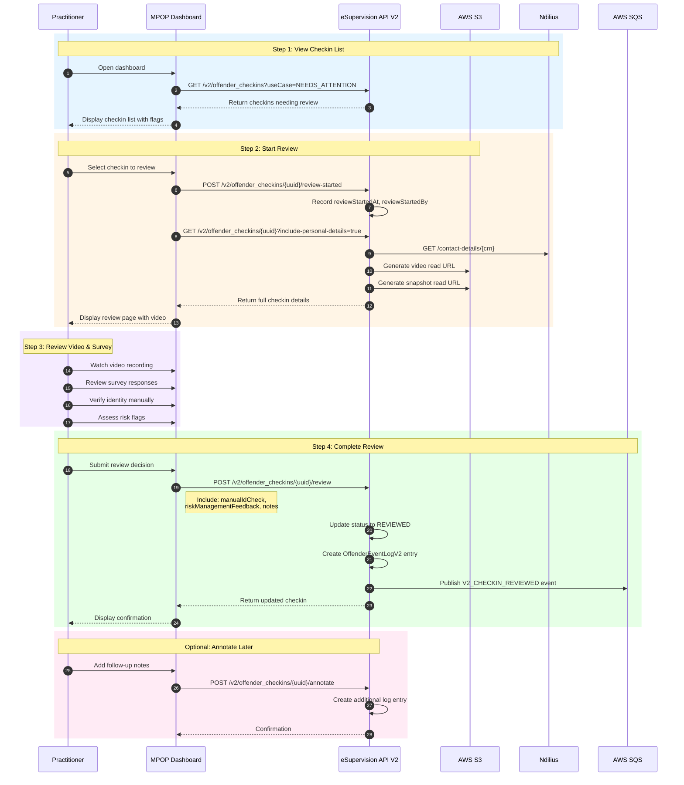

# V2 User Journeys

Detailed flow diagrams for all user-facing journeys in the V2 eSupervision system.

---

## 1. Offender Setup Flow

Initiated by a **Practitioner** via MPOP dashboard to register an offender for remote check-ins.

### Setup Endpoints

| Method | Endpoint | Description |
|--------|----------|-------------|
| `POST` | `/v2/offender_setup` | Start offender setup |
| `POST` | `/v2/offender_setup/{uuid}/upload_location` | Get photo upload URL |
| `POST` | `/v2/offender_setup/{uuid}/complete` | Complete setup |
| `POST` | `/v2/offender_setup/{uuid}/terminate` | Cancel setup |

---

## 2. Checkin Journey Flow

Initiated by an **Offender** clicking the check-in link in their SMS/email notification.

### Checkin Status Flow

---

## 3. Practitioner Review Flow

Initiated by a **Practitioner** reviewing a submitted check-in in MPOP.

### Review List Use Cases

| Use Case | Description | Query Parameter |
|----------|-------------|-----------------|
| Needs Attention | Submitted or unreviewed expired | `useCase=NEEDS_ATTENTION` |
| Reviewed | Completed reviews | `useCase=REVIEWED` |
| Awaiting Checkin | Created, waiting for offender | `useCase=AWAITING_CHECKIN` |

---

## 4. Checkin Endpoints Summary

| Method | Endpoint | Description |
|--------|----------|-------------|
| `GET` | `/v2/offender_checkins` | List checkins (paginated) |
| `GET` | `/v2/offender_checkins/{uuid}` | Get checkin details |
| `POST` | `/v2/offender_checkins/{uuid}/identity-verify` | Verify offender identity |
| `POST` | `/v2/offender_checkins/{uuid}/upload_location` | Get video/snapshot upload URLs |
| `POST` | `/v2/offender_checkins/{uuid}/video-verify` | Facial recognition verification |
| `POST` | `/v2/offender_checkins/{uuid}/submit` | Submit checkin |
| `POST` | `/v2/offender_checkins/{uuid}/review-started` | Mark review started |
| `POST` | `/v2/offender_checkins/{uuid}/review` | Complete review |
| `POST` | `/v2/offender_checkins/{uuid}/annotate` | Add annotation |
| `GET` | `/v2/offender_checkins/{uuid}/proxy/video` | Get video URL |
| `GET` | `/v2/offender_checkins/{uuid}/proxy/snapshot` | Get snapshot URL |
